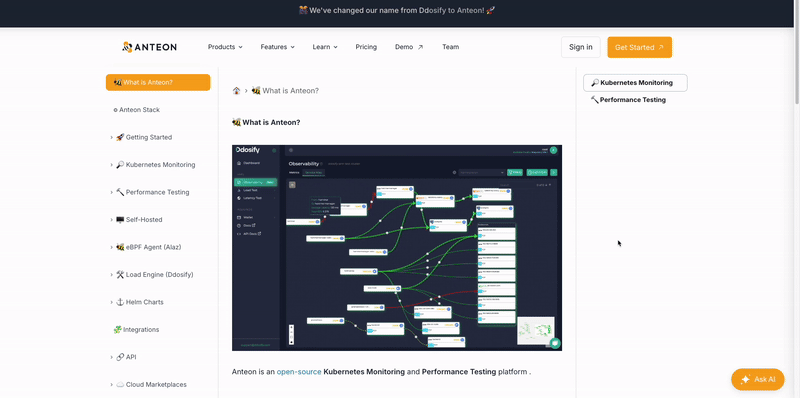

# Gurubase Widget
This repository includes the script for the 'Ask AI' widget, which you can add to your Guru's AI capabilities into your website.

<p align="center">
  
</p>

## Prerequisites

- **Your website should have a Guru on Gurubase.io.** If not, [request a new Guru](https://github.com/Gurubase/gurubase?tab=readme-ov-file#how-to-create-a-guru).
- **You need to have a Widget ID.** You can get it from your Guru's settings page on Gurubase.io.
   - Go to "My Gurus" page
   - Select the Guru you want to add the widget to
   - On the "Widget" section create a new widget
   - Copy the Widget ID and use it in the installation section

## Installation
The only thing you need to do is to add the widget.js to your website as follows:
```html
<!-- Gurubase Widget -->
<script async src="https://widget.gurubase.io/widget.latest.min.js" 
    data-widget-id="<your_widget_id>"
    id="guru-widget-id">
</script>
```

> [!IMPORTANT]
> The value of the `id` attribute should be `"guru-widget-id"`, don't change it.

`src`, `data-widget-id`, `id` are required. You can modify the rest of the attributes to customize the widget by using the below options.

## Configuration Options

| Option | Type | Description | Default |
|--------|------|-------------|---------|
| data-widget-id | string | Your widget ID | Required |
| data-text | string | Text displayed on the chat button | "Ask AI" |
| data-margins | object | Button positioning margins | { bottom: "20px", right: "20px" } |
| data-bg-color | string | Primary color for the widget | Fetched from the Gurubase.io |
| data-icon-url | string | URL to your company/product logo | Fetched from the Gurubase.io |
| data-name | string | Your company/product name | Fetched from the Gurubase.io |
| data-light-mode | boolean | Whether to use light mode | false |

## Demos
Below are example installations of the Gurubase Widget for various technologies. If your technology isn’t listed, we’d gladly accept a demo, feel free to submit a pull request.

- [Astro - Starlight](https://github.com/Gurubase/gurubase-widget/tree/master/examples/astro-starlight)
- [Docusaurus](https://github.com/Gurubase/gurubase-widget/tree/master/examples/docusaurus)
- [Mintlify](https://github.com/Gurubase/gurubase-widget/tree/master/examples/mintlify)
- [MKDocs](https://github.com/Gurubase/gurubase-widget/tree/master/examples/mkdocs)
- [Next.js](https://github.com/Gurubase/gurubase-widget/tree/master/examples/nextjs)
- [JS](https://github.com/Gurubase/gurubase-widget/tree/master/examples/pure_js)
- [React](https://github.com/Gurubase/gurubase-widget/tree/master/examples/react_app)
- [Remix](https://github.com/Gurubase/gurubase-widget/tree/master/examples/remix)
- [Sphinx](https://github.com/Gurubase/gurubase-widget/tree/master/examples/sphinx)