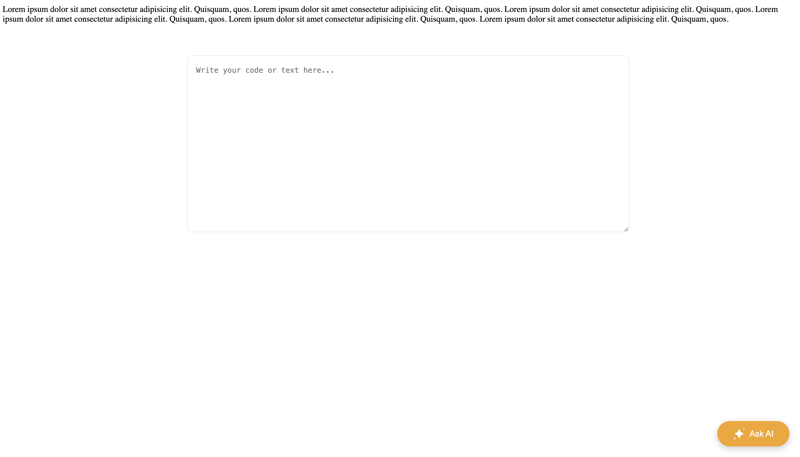
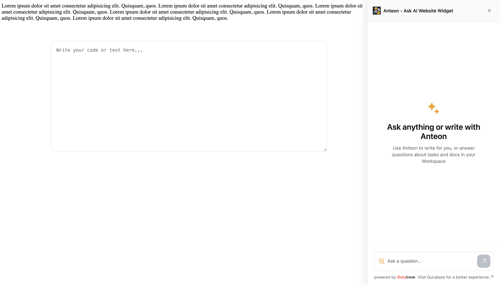
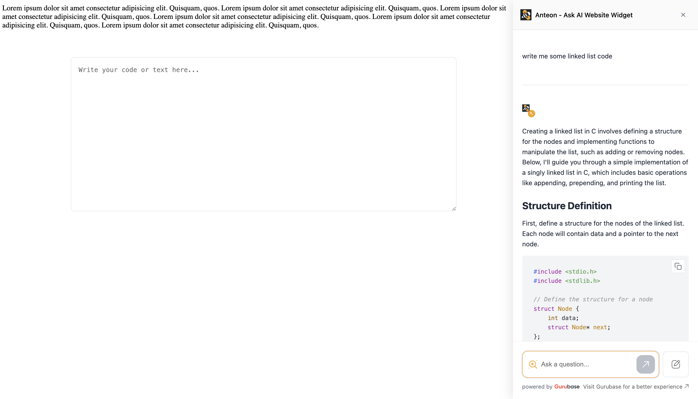
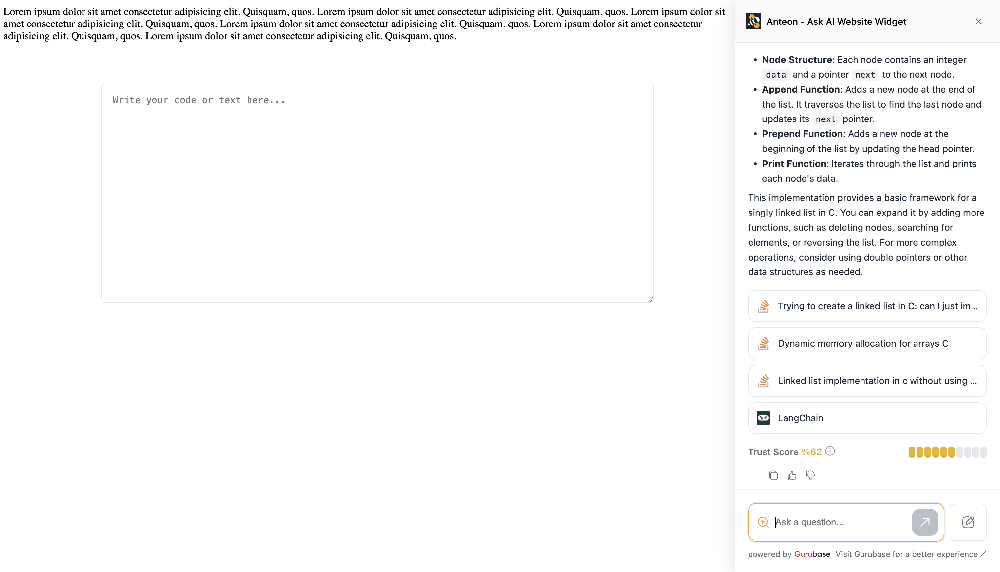

# Gurubase Widget

A lightweight, customizable chat widget that can be easily integrated into any website. It connects your webpage to Gurubase, an AI-powered chat interface that can answer any question regarding your product.

## Features

- 🚀 Easy integration

- 💬 Real-time streaming responses

- 🎨 Customizable appearance

- 📱 Responsive design

- 🔒 Secure API integration

- 📊 Trust score indicators

- 🔗 Reference link support

- ⌨️ Markdown support

- 🎯 Code syntax highlighting

## Installation

Add the widget to your website by including these scripts in your HTML:

```html
<!-- Gurubase Widget Config -->
<script>
    window.WIDGET_CONFIG = {
    widgetId: "your-widget-id",
    apiUrl: "http://localhost:8018",
    buttonText: "Ask AI",
    margins: { bottom: "20px", right: "20px" },
    mainColor: "#F5A51D",
    logoUrl: "https://avatars.githubusercontent.com/u/75415501?s=200&v=4",
    name: "Anteon"
    };
</script>

<!-- Gurubase Widget -->
<script src="/path/to/widget.js"></script>
```

## Usage

### Configuration Options

| Option | Type | Description | Default |
|--------|------|-------------|---------|
| widgetId | string | Your widget ID (Click [here](https://gurubase.io) to get one) | Required |
| apiUrl | string | Endpoint URL for the chat service | Required |
| buttonText | string | Text displayed on the chat button | "Ask AI" |
| margins | object | Button positioning margins | { bottom: "20px", right: "20px" } |
| mainColor | string | Primary color for the widget | "#F5A51D" |
| logoUrl | string | URL to your company logo | Required |
| name | string | Your company/product name | Required |

## Customization

### Styling

The widget can be customized through the following configuration options:

- `mainColor`: Change the primary color of the widget.
- `logoUrl`: Change the logo displayed in the widget.
- `name`: Change the name displayed in the widget.
- `buttonText`: Change the text displayed on the chat button.
- `margins`: Change the margins of the chat button.

#### Examples









## License
MIT License - see the LICENSE file for details.

## Support

For any issues or support requests, please contact us at [support@gurubase.com](mailto:support@gurubase.com).
