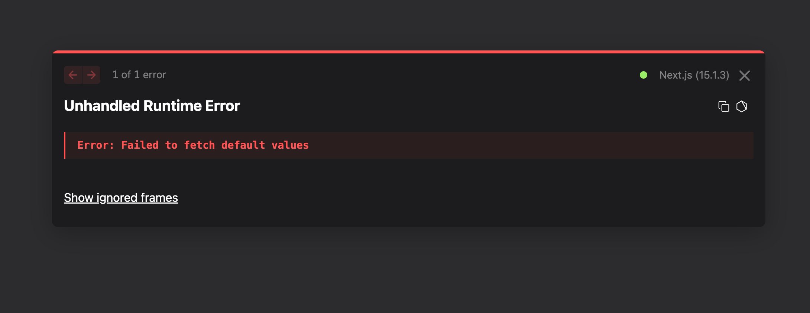

# Next.js Example for Gurubase Widget

This is a simple Next.js example.

## Gurubase Widget Integration

1. The following is created in `components/GurubaseWidget.js`.

```js
'use client'

import Script from 'next/script'

export default function GurubaseWidget({
  widgetId,
  text = "Ask AI",
  margins = { bottom: "20px", right: "20px" },
  lightMode = false,
  bgColor,
  iconUrl,
  name,
}) {
  return (
    <Script
      src="https://widget.gurubase.io/widget.latest.min.js"
      strategy="lazyOnload"
      async
      id="guru-widget-id"
      data-widget-id={widgetId}
      data-text={text}
      data-margins={JSON.stringify(margins)}
      data-light-mode={String(lightMode)}
      {...(name && { "data-name": name })}
      {...(iconUrl && { "data-icon-url": iconUrl })}
      {...(bgColor && { "data-bg-color": bgColor })}
    />
  )
}
```

2. The following is added to your page, layout, etc.

```js
import GurubaseWidget from '../components/GurubaseWidget'

export default function Home() {
  return (
    <>
      <GurubaseWidget 
        widgetId="YOUR_WIDGET_ID" // Replace with your actual widget ID
        // Optional props:
        // text="Ask AI"
        // margins={{ bottom: "20px", right: "20px" }}
        // lightMode={false}
        // bgColor="YOUR_BG_COLOR"
        // iconUrl="YOUR_ICON_URL"
        // name="YOUR_NAME"
      />
    </>
  )
}
```

## Usage

```bash
npm install
npm run dev
```

> Note, this error is expected as the widget is not correctly connected to the widget ID. In that case, you can close the error and continue.

